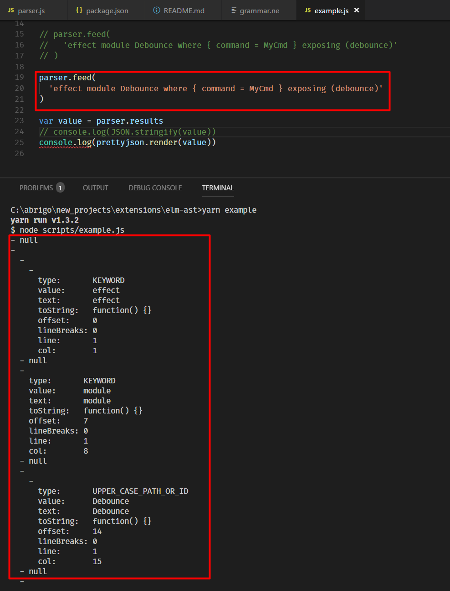

## Experiment, not actively developed!

* It uses parser https://nearley.js.org/
* And lexer https://github.com/no-context/moo
* How to run
  1.  `yarn`
  2.  `yarn example`
  3.  You should see parsed code from `src/example.js` (line 20)
* Grammar is in `src/grammar.ne` (there are useful links to Elm grammar used in Intellij on the first lines of that file)

---

# MartinKavik / elm-ast []

A grammar and stream-friendly parser.

Crafted with ♡ by MartinKavik

Made possible by the _super awesome_ [nearley](https://nearley.js.org/) parser toolkit.
